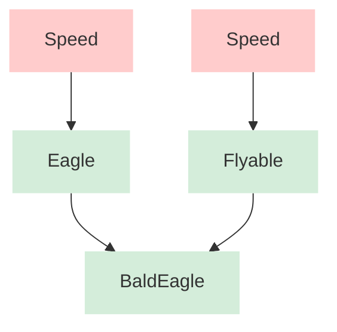
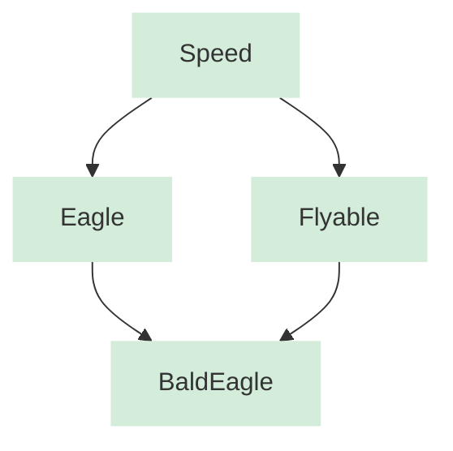

import CodeEditor from '@site/src/components/CodeEditor';

# Inheritance & polymorphism

A class is a definition of an object. It describes the algorithms, the data, it's format and relations to other classes. An object is a concrete instantiation of a class. **A class is a user-defined type**.

## Is-a principle

A class relationship defines an *is-a* relationship if the derived class **publicly** inherits the base class:

```cpp

class Rectangle {}

class Square : public Retangle {}

```
Here we are saying that a `Square` is  a `Retangle`. The `Square` exposes all of `Retangle` public methods and members. We are creating a **contract** here that states, any object that requires a `Retangle` can also accept a `Square`.

## Has-a principle

A class relationship defines an *Has-a* relationship if the derived class **privately** inherits the base class:

```cpp

class Container : private std::vector<int> {
public:
  using std::vector<int>::size;
}

```

`Container` privately extends `std::vector<int>`. This is a *Has-a* relationship. The derived class get's the implementation details from the base class. The derived class cannot be used in place of the base class.

It's also possible to expose `std::vector` methods publicly with the help of `using`.

::::note
**Composition over inheritance**:

Generally it's prefered to compose over inherit. This `Container` is a great example. While this works and we can use the `std::vector` implementation this way, the prefered method is composition:

```cpp
class Container {
private:
  std::vector<int> data;
}
```
::::

::::note
**Empty Base Class Optimization (EBCO)**

In C++ it's not possible to reference an object that no size in memory. An empty struct is given the size of 1 byte.

However, if a derived class extends an empty base class, the size of the object becomes the size of the derived class, the base class may have no size.

You can also use `[[no_unique_address]]` in C++20 to keep `Base` as a member but make sure it does not have a unique address. A good example is `unique_ptr`

```cpp
#include <iostream>

class Base {};

class Derived : public Base {
  int data;
};

class Composed {
  Base base;
  int data;
};

int main() {
  std::cout << sizeof(Base) << std::endl;    // 1 byte
  std::cout << sizeof(Derived) << std::endl; // 4 bytes
  std::cout << sizeof(Composed) << std::endl; // 8 bytes (3 bytes of padding)
}
```

```cpp
#include <iostream>

class Deleter {
public:
  void operator() (void *) {
    // delete
  };
};

template<class T, class Deleter>
class unique_ptr_bad {
    T* pointer = nullptr;
    Deleter deleter;

   public:
    ~unique_ptr_bad() {
        deleter(pointer); // overloaded operator()
    };
};

template<class T, class Deleter>
class unique_ptr_good {
    T* pointer = nullptr;
    [[no_unique_address]] Deleter deleter;

   public:
    ~unique_ptr_good() {
        deleter(pointer); // overloaded operator()
    };
};

int main() {
  unique_ptr_bad<int, Deleter> bad;
  unique_ptr_good<int, Deleter> good;

  std::cout << sizeof(bad) << std::endl;  // 16 byte
  std::cout << sizeof(good) << std::endl; // 8 bytes
}
::::

## Polymorphism through inheritance
This here is **runtime polymorphism**.

```cpp
#include <iostream>

using namespace std;

class Base {
public:
  virtual void type() {
    cout << "Base" << endl;
  }
};

class DerivedPublic : public Base {
public:
  void type() override {
    cout << "DerivedPublic" << endl;
  }
};

class DerivedPrivate : private Base {
public:
  void type() override {
    Base::type();
  }
};

int main() {
  DerivedPublic *derived_public = new DerivedPublic();
  DerivedPrivate *derived_private = new DerivedPrivate();

  Base *base = derived_public;                                        // Upcasting from `DerivedPublic*` to `Base*` implicitly.
  // DerivedPublic *downcasted_base = base;                           // ERROR: Cannot implicitly downcast
  DerivedPublic *downcasted_base_s = static_cast<DerivedPublic*>(base);   // Downcast via static_cast is allowed.
  DerivedPublic *downcasted_base_d = dynamic_cast<DerivedPublic*>(base);  // Downcast via dynamic_cast is allowed, it has a runtime cost, looking up the vtable but it's safe to call. If you tried to cast to a wrong type, you'll get a nullptr. If it's a reference, you'll get a runtime error.

  // Base *base_private = derived_private;                            // ERROR: Cannot implicitly upcast from 'DerivedPrivate*' to 'Base*' due to private inheritance
  // Base* base_private = static_cast<Base*>(derived_private);        // ERROR: Cannot upcast from 'DerivedPrivate*' to 'Base*' using static_cast due to private inheritance

  derived_public->type();                    // DerivedPublic           | Virtual table lookup
  derived_public->Base::type();              // Base                    | Bypass the virtual table lookups, You can call the base implementation this way
  derived_public->DerivedPublic::type();     // DerivedPublic           | Bypass the virtual table lookups

  derived_private->type();          // Base           | type() is exposed ONLY because we publicly overrode it and it calls its base implementation
  // derived_private->Base::type(); // ERROR          | Base is privately extended

  base->type();                     // DerivedPublic  | Virtual table lookup, even though it's a Base*, it points to a DerivedPublic* object
  base->Base::type();               // Base           | Bypass the virtual table lookups, You can call the base implementation this way

  delete derived_public;
  delete derived_private;

  return 0;
}
```

::::info
**Size of a struct** & **Size of a class**

The size of a `struct` or `class` that has no data members is `0`. However, a **unique address** must be assigned to it if we use this empty `struct`.
In C++, it gets the size of `1`.

If a `Derived` class inherits an empty `Base`, the size of the `Derived` class will be the size of all it's members aligned to the size largest primitive member. (The member with the greatest alignment requirement)

You can also use `[[no_unique_address]]` to tell the compiler that we don't need a **unique address** for this member.
The `unique_ptr` example above demonstraits a good usage of this, `Deleter` overrides the `()` operator, it has no members and we don't want it to take up 
any additional memory but we want it to be a member, which is why we used `[[no_unique_address]]`.

```cpp
#include <iostream>

class Base {};

class DerivedA : public Base {
  int a;
};

class DerivedB {
  int a;
  Base base;
};

class DerivedC {
  int a;
  [[no_unique_address]] Base base;
};

int main() {
  std::cout << sizeof(Base) << std::endl;
  std::cout << sizeof(DerivedA) << std::endl;
  std::cout << sizeof(DerivedB) << std::endl;
  std::cout << sizeof(DerivedC) << std::endl;
  return 0;
}
```
::::

## Multiple inheritance

In the example below, both `Bird` & `FlyingAnimal` have a virtual method `fly()`. This compiles successfully but if `Eagle::fly()` is called the program 
throws an error `request for member 'fly' is ambiguous`.

If `Eagle` overrides `fly()` there will be no error because `fly()` will not be ambiguous anymore.

```cpp
#include <iostream>

class Bird {
public:
  virtual void fly() {
    std::cout << "Bird fly" << std::endl;
  };
};

class FlyingAnimal {
public:
  virtual void fly() {
    std::cout << "FlyingAnimal fly" << std::endl;
  };
};

class Eagle : public Bird, public FlyingAnimal {
// public:
//   void fly() override {
//     std::cout << "Eagle fly" << std::endl;
//   };
};

int main() {
  Eagle e;

  // Uncomment this line
  // e.fly(); // Ambiguous | Both Bird & FlyingAnimal have the method fly.

  return 0;
}
```

## Virtual inheritance

Virtual inheritance is a technique that ensures a nested base class is only inherited once by grandchild derived classes, effectively resolving the ambiguities caused by multiple inheritance.

### Without virtual inheritance
This diagram shows the classic "Diamond Problem" where `Speed` is duplicated, resulting in two separate instances inside `BaldEagle`.


### With virtual inheritance
This diagram shows how virtual inheritance uses pointers to reference a single, **shared instance** of `Speed` at the bottom of the hierarchy.



```cpp
#include <iostream>

class Speed {
public:
  int speed = 42;
  virtual ~Speed() = default;
  virtual void move() { std::cout << "Speed move()" << std::endl; }
};

// Use "virtual" inheritance to get a shared instance of Speed
class Flyable : virtual public Speed {
public:
  virtual ~Flyable() = default;
  virtual void move() { std::cout << "Flyable move()" << std::endl; }
};

class Eagle : virtual public Speed {
public:
  virtual ~Eagle() = default;
  virtual void move() { std::cout << "Eagle move()" << std::endl; }
};

// Child inherits from both Parents
// Both Eagle & Flyable have a shared instance of Speed because of virtual inheritance
class BaldEagle : public Eagle, public Flyable {
public:
  // Resolve method ambiguity explicitly
  void move() override {
    Eagle::move();
  }
};

int main() {
  BaldEagle o;
  o.speed = 99; 
  o.move(); 

  std::cout << "Shared Data: " << o.speed << std::endl;

  return 0;
}
```

## Final inheritance

Final inheritance refers to preventing a class from being used as a base class for any further inheritance. It is the definitive way to say, *"This family tree ends here."*

`final` can use used to restrict subtype polymorphism

There are two places you can use the `final` keyword:
  * Prevent class inheritance
  * Prevent method overloading

### Preventing Class Inheritance (`final` Class)
When you apply final to a class definition, any attempt to derive a new class from it will trigger a compile-time error.
```cpp
#include <iostream>

class Base {};

class Anchor final : public Base {
public:
    void log() { std::cout << "Anchor processing..." << std::endl; }
};

// ERROR: Compile-time error! 'SubAnchor' cannot inherit from 'final' 'Anchor'
// class SubAnchor : public Anchor {};
```

### Preventing Method Overriding (final Method)
You can also use `final` on a specific virtual function to allow inheritance of the class, but prevent that specific method from being overridden further down the chain.

```cpp
class Device {
public:
    virtual void boot() { std::cout << "Device booting..." << std::endl; }
};

class Laptop : public Device {
public:
    // Laptop overrides boot, but seals it for any future sub-classes
    void boot() override final { 
        std::cout << "Laptop secure booting..." << std::endl; 
    }
};

class GamingLaptop : public Laptop {
public:
    // ERROR: Compile-time error! Cannot override 'final' function 'Laptop::boot'
    // void boot() override { std::cout << "RGB Booting..." << std::endl; }
};
```

### The Hidden Benefit: Devirtualization (Performance)
Beyond making your code structurally safer, `final` provides a great optimization hint to the C++ compiler called **devirtualization**.

Normally, when you call a virtual function, the program has to look up the function address at runtime using a **Vtable** (**Virtual Table**) pointer. This adds a tiny bit of latency and prevents the compiler from performing inline optimizations.

**When a class or method is marked final:**
* The compiler realizes at compile-time that no other class can ever override this method.
* It completely bypasses the Vtable lookup mechanism.
* It converts the expensive dynamic dispatch into a standard, lightning-fast direct function call (and may even inline the code entirely).

## References & citations
  * **Hands-On Design Patterns with C++**, Chapter 2, ("Inheritance & polymorphism"). **Fedor G. Pikus**.
